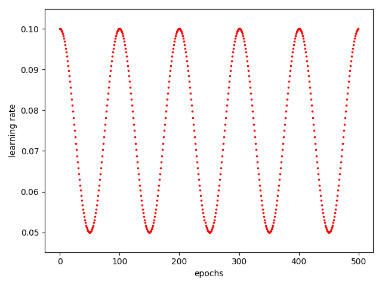

## CosineAnnealingLR

> 特点是简单好用  [[DOCS](https://pytorch.org/docs/stable/generated/torch.optim.lr_scheduler.CosineAnnealingLR.html)] [[CODE](https://pytorch.org/docs/stable/_modules/torch/optim/lr_scheduler.html#CosineAnnealingLR)] 


`torch.optim.lr_scheduler.CosineAnnealingLR(optimizer, T_max, eta_min=0, last_epoch=- 1, verbose=False)`

**parameter:**

- **optimizer** (*Optimizer*)– Wrapped optimizer.
- **T_max** (*int*) – Maximum number of iterations.
- **eta_min** (*float*) – Minimum learning rate. Default: 0.
- **last_epoch** (*int*) – The index of last epoch. Default: -1.
- **verbose** (*bool*) – If `True`, prints a message to stdout for each update. Default: `False`.


T_max决定学习率的波动周期，T_max=5时周期为5




### CosineAnnealingWarmRestarts

> [[DOCS](https://pytorch.org/docs/stable/generated/torch.optim.lr_scheduler.CosineAnnealingWarmRestarts.html)] [[CODE](https://pytorch.org/docs/stable/_modules/torch/optim/lr_scheduler.html#CosineAnnealingLR)]

`torch.optim.lr_scheduler.CosineAnnealingWarmRestarts(optimizer, T_0, T_mult=1, eta_min=0, last_epoch=- 1, verbose=False)`

**Parameter:**

- **optimizer** (*Optimizer*) – Wrapped optimizer.
- **T_0** (*int*) – Number of iterations for the first restart.
- **T_mult** (*int**,* *optional*) – A factor increases T_i after a restart. Default: 1.
- **eta_min** (*float**,* *optional*) – Minimum learning rate. Default: 0.
- **last_epoch** (*int**,* *optional*) – The index of last epoch. Default: -1.
- **verbose** (*bool*) – If `True`, prints a message to stdout for each update. Default: `False`.


具体地说，

- T_0：学习率第一次回到初始值的epoch位置
- T_mult：控制学习率变化的速度。学习率在 `T_0`, `(1 + T_mult)*T_0`, `(1 + T_mult + T_mult^2)*T_0` ...处将回到初始值。


## Code

```python
import torch
from torch.optim.lr_scheduler import CosineAnnealingLR,CosineAnnealingWarmRestarts,StepLR
import torch.nn as nn
from torchvision.models import resnet18
import matplotlib.pyplot as plt

model=resnet18(pretrained=False)
optimizer = torch.optim.SGD(model.parameters(), lr=0.1)
mode='cosineAnnWarm'
'''
以T_0=5, T_mult=1为例:
T_0:学习率第一次回到初始值的epoch位置.
T_mult:这个控制了学习率回升的速度
	- 如果T_mult=1,则学习率在T_0,2*T_0,3*T_0,....,i*T_0,....处回到最大值(初始学习率)
		- 5,10,15,20,25,.......处回到最大值
	- 如果T_mult>1,则学习率在T_0,(1+T_mult)*T_0,(1+T_mult+T_mult**2)*T_0,.....，(1+T_mult+T_mult**2+...+T_0**i)*T0,处回到最大值
		- 5,15,35,75,155,.......处回到最大值
example:
	T_0=5, T_mult=1
'''
if mode=='cosineAnn':
    scheduler = CosineAnnealingLR(optimizer, T_max=5, eta_min=0)
elif mode=='cosineAnnWarm':
    scheduler = CosineAnnealingWarmRestarts(optimizer,T_0=5,T_mult=1)
    
plt.figure()
epochs=50
dataloader = Dataloader()
cur_lr_list = []
for epoch in range(epochs):
	for (data, label) in enumerate(dataloader):
		train()
		eval()
        '''
        这里scheduler.step(epoch + batch / iters)的理解如下,如果是一个epoch结束后再.step
        那么一个epoch内所有batch使用的都是同一个学习率,为了使得不同batch也使用不同的学习率
        则可以在这里进行.step
        '''
        # scheduler.step(epoch + batch / iters)
        optimizer.step()
    scheduler.step()
    cur_lr=optimizer.param_groups[-1]['lr']
    cur_lr_list.append(cur_lr)
    print('cur_lr:',cur_lr)
x_list = list(range(len(cur_lr_list)))
plt.plot(x_list, cur_lr_list)
plt.show()
```

